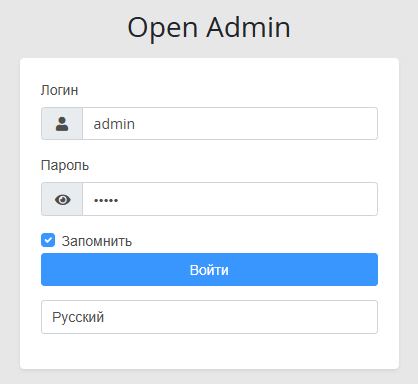
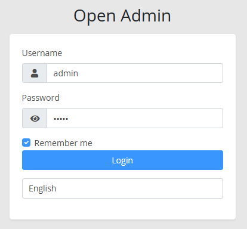
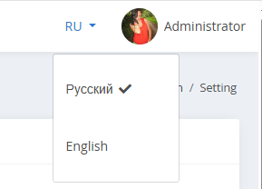

laravel-admin Multi Language
======

## Инсталяция

```
composer require laravel-packages/multi-language
```

## Конфиг


Сначала добавьте конфигурацию расширения

в `config/admin.php`

```
    // Настройки расширений
    'extensions' => [
        'multi-language' => [
            'enable' => true,
            // ключ должен быть таким же, как var locale в config/app.php
            // значение используется для отображения
            'languages' => [
                'ru' => 'Русский',
                'en' => 'English',
            ],
            // локаль по умолчанию
            'default' => 'ru',
            // показывать или нет многоязычную страницу входа в систему, необязательно, по умолчанию true
            'show-login-page' => true,
            // показывать или нет многоязычную панель навигации, необязательно, по умолчанию true
            'show-navbar' => true,
            // имя cookie для многоязыковой переменной, необязательно, по умолчанию — «locale»
            'cookie-name' => 'locale'
        ],
        ...
    ],
```
Добавить в bootstrap/app.php в секцию ->withMiddleware

```
<?php


use Illuminate\Foundation\Application;
use Illuminate\Foundation\Configuration\Exceptions;

// добавьте эту строку !
use OpenAdminCore\Admin\MultiLanguage\Middlewares\MultiLanguageMiddleware;

use Illuminate\Foundation\Configuration\Middleware;

return Application::configure(basePath: dirname(__DIR__))
    ->withRouting(
        web: __DIR__.'/../routes/web.php',
        api: __DIR__.'/../routes/api.php',
        commands: __DIR__.'/../routes/console.php',
        health: '/up',
    )
    ->withMiddleware(function (Middleware $middleware) {
    
        // добавить ниже 2 строки
        $middleware->web(append: [
            MultiLanguageMiddleware::class
        ]);
        
    })
    ->withExceptions(function (Exceptions $exceptions) {

    })->create();

```

Затем добавьте маршрут в auth

в `config/admin.php`, добавьте `locale` в `auth.excepts`

```
    'auth' => [
        ...
        // URI, которые следует исключить из авторизации.
        'excepts' => [
            'auth/login',
            'auth/logout',
            // добавьте эту строку !
            'locale',
        ],
    ],

```

Затем запустите команду для публикации ресурсов:

```
php artisan vendor:publish --tag=multi-language
```


## ScreenShots





